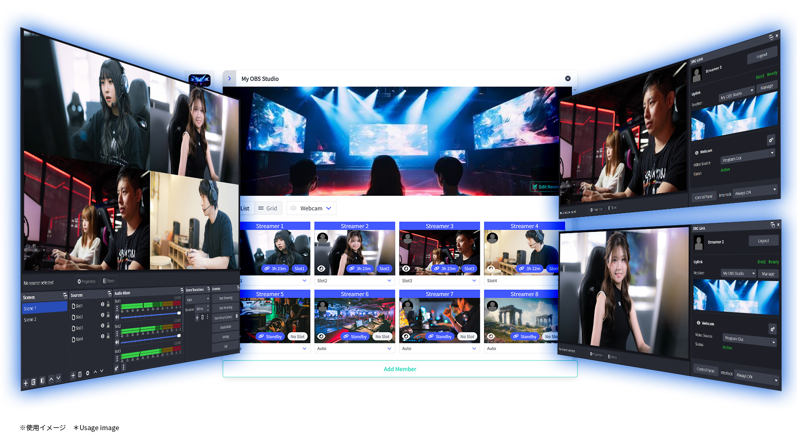

# SRC-Link (The OBS Studio Plugin)

## Features

**[EN]**

SRC-Link (Secure Reliable Controllable Link) introduces remote, multiperson, secure, reliable and efficient **orchestration method** to your [OBS Studio](https://obsproject.com/).

SRC-Link works with [SRC-Link Control Panel](https://src-link.live/introduction) Web service.

**Key features**

- A host can receive multiple video/audio streams from guests in parallel. The guest to receive can be selected from among the members.
- Guests can connect to receiver and enter standby mode. The standby state allows transmission to begin at any time, and the host's commands initiate video and audio transmission.
- There is no need to send connection information (address, stream ID, password, etc.) to guests.
  Guests do not need to configure them in OBS Studio.
- The host can view the guest's standby status and video screenshots (updated every 5 to 30 seconds) on the SRC-Link Control Panel.
- Since a guest in standby mode is literally just waiting without transmitting video or audio, there can theoretically be far more streams (whether 10, 100, or 1,000) than the host can receive.
  * However, there is a limit in the SRC-Link Control Panel plan.
- SRT is used as the transmission protocol for video and audio. Stream ID and passphrase are controlled by the SRC-Link Control Panel.

**Glossary**

- **HOST**: OBS instance (and SRC-Link user) receiving video and audio
- **GUEST**: OBS instance (and SRC-Link user) transmitting video and audio
- **RECEIVER**: Represents a group of inputs handled by the host. Usually a single OBS instance is assumed, but it is possible to receive in more than one. A receiver can contain multiple slots and multiple members.
- **SLOT**: One slot represents a set of inputs for one guest. This means that multiple sources (webcam, game capture, etc.) can be configured per slot. The guest sends all sources in parallel, so switching and compositing can be done by the host.
- **SOURCE**: Guests can send multiple sources in parallel. The number of sources is specified by the host, and the guest is free to select video and audio from its own OBS sources.
- **MEMBER**:  Registered guests who can connect to the receiver and standby.
- **INVITATION CODE**: To invite a guest to the receiver, the host generates an invitation code and sends it to the guest. The guest becomes a member by redeeming the code.
- **GUEST CODE**: To request a host to join, a guest sends his/her guest code to the host. The host uses the guest code to register as a member.
- **DOWNLINK**: Host-side input connections
- **UPLINK**: Guest-side output connection

**[JP]**

SRC-Link (Secure Reliable Controllable Link) は、[OBS Studio](https://obsproject.com/) にリモートかつ多人数間で、安全で信頼性が高く効率的なオーケストレーション機能を追加します。

SRC-Link はウェブサービスの [SRC-Link Control Panel](https://src-link.live/introduction) とともに使用します。

**主な機能**

- ホストは、ゲストから複数の映像音声をパラで受信することができます。受信対象はメンバーの中から選択することができます。
- ゲストは、レシーバーに接続してスタンバイ状態になることができます。
  スタンバイ状態は送信開始がいつでも可能な状態で、ホストのコマンドによって映像音声の送信を開始します。
- ゲストに接続情報（アドレス、ストリームID、パスワード等）を送付する必要はありません。
  ゲストはそれらを OBS Studio に設定する必要がありません。
- ホストは、ゲストのスタンバイ状態と映像スクリーンショット（5～30秒間隔で更新）を SRC-Link Control Panel 上で確認することができます。
- スタンバイ状態のゲストは、文字通り映像音声を送信せずに待機しているだけなので、理論上、ホストが受信可能なストリーム数よりはるかに多い数（10 でも 100 でも 1,000 でも）存在できます。
  ※ただし、SRC-Link Control Panel のプランで上限があります。
- 映像音声の伝送プロトコルは SRT を使用しています。ストリームIDやパスフレーズは SRC-Link Control Panel により制御されます。

**用語集**

- **ホスト**: 映像音声を受信する OBS インスタンス（及び SRC-Link ユーザー）
- **ゲスト**: 映像音声を送信する OBS インスタンス（及び SRC-Link ユーザー）
- **レシーバー**: ホストが扱うインプットのグループを表します。 通常は単一の OBS インスタンスが想定されますが、複数で受信することも可能です。 レシーバーには複数のスロット、複数のメンバーが含まれます。
- **スロット**: 1 つのスロットは、ゲスト 1 人分のインプットのセットを表します。つまり、スロット 1 つにつき複数のソース (Web カメラ、ゲームキャプチャなど) を設定できます。ゲストはすべてのソースをパラで送信しますから、ホスト側でスイッチングや合成が可能です。
- **ソース**: ゲストは複数のソースをパラで送信できます。ソースの数はホストによって指定され、ゲストは自身の OBS ソースから自由にビデオとオーディオを選択できます。
- **メンバー**: レシーバーに接続して待機可能な、登録済みのゲストです。
- **招待コード**: レシーバーにゲストを招待するには、ホストが招待コードを生成してゲストへ送付します。ゲストはコードを引き換える事でメンバーになります。
- **アカウントコード**: ゲストからホストに参加を申し込むには、自身のアカウントコードをホストに送付します。ホストはアカウントコードを使用してメンバー登録します。
- **ダウンリンク**: ホスト側の入力接続
- **アップリンク**: ゲスト側の出力接続

## Requirements

[OBS Studio](https://obsproject.com/) >= 30.1.0 (Qt6, Windows x64)

> Mac OS, Linux isn't tested yet.

**[EN]**

Also required signing up to [SRC-Link Control Panel](https://src-link.live) 
Separate [paid subscription plans](https://src-link.live/subscriptions/plans) are available.

**[JP]**

また、[SRC-Link Control Panel](https://src-link.live) へのサインアップが必要です。
別途、[有償サブスクリプションプラン](https://src-link.live/subscriptions/plans)があります。

# Installation

**[EN]**

Please download latest install package from [Release](https://github.com/OPENSPHERE-Inc/src-link/releases)

> NOTE: The windows copies installs `Qt6WebSockets.dll` and Qt6's `tls` plugins folder under your `obs-studio/bin/64bit` as required library.

**[JP]**

次のページよりインストラーパッケージをダウンロードしてください: [Release](https://github.com/OPENSPHERE-Inc/src-link/releases)

> 注意: Windows インストーラーは必要なライブラリとして `Qt6WebSockets.dll` と Qt6 の `tls` プラグインフォルダを `obs-studio/bin/64bit` 配下にコピーします。

# User manual

**[EN]**

## For Host

1. Sign up/login to the [SRC-Link Control Panel](https://src-link.live) in a web browser then setup the receiver. Normally, a sample is created after sign-up, so edit this.
   
   First add/remove as many slots as you need (the number of guests appearing on the stream at the same time).

   Then add/remove as many sources as you want to receive from one guest (e.g. 2 sources for a webcam and a game screen).

2. By default, you are registered as a member of the receiver, but this is mainly for testing purposes, so you can delete or disable it (click the eye icon) if you do not need it (you can also send and receive yourself, but the video may loop).

3. Install the SRC-Link plugin in OBS Studio [Download here](https://github.com/OPENSPHERE-Inc/src-link/releases)

4. Launch OBS Studio and click “SRC-Link Settings” from the “Tools” menu or the “Login” button on the “SRC-Link” dock.

5. A web browser will open and an approval screen will appear. Click the “Accept” button.

   OBS Studio and SRC-Link Control Panel are now connected and ready to use.

6. Open “SRC-Link Settings” from the “Tools” menu in OBS Studio. Under “UDP Port Range for listen” set the range of UDP ports to be used. These ports must be accessible from the outside. If you are in a NAT router or FW environment, please open the ports.

   The number of ports required is equal to the total number of sources.

   In environments where opening ports is difficult, consider [installing a relay server](https://src-link.live/docs/relay-server).

7. In OBS Studio, add “SRC-Link Downlink” to the source. In the source properties, select the receiver, slot, and source that this input will receive. These must not be the same combination of things in other sources (you will not get an error, but you will receive only one of them due to conflicts).

   The source properties also allow you to set the resolution and bitrate range, and these settings act as regulators for the guest-side settings.

   “Relay Server” should be checked if you want to use it. Cannot be checked if unavailable in your plan or no set up in the receiver.

8. Press OK to close the source properties and the source will go into receive standby (if set up correctly, the red warning indicator will disappear).

9. Open the [Host](https://src-link.live/receivers) menu of the SRC-Link Control Panel again and add members to the receiver for each person scheduled to appear. There are two ways to do this: send an invitation code to the guest or receive an guest code from the guest and enter it. Invitation codes are the format `SRCH-xxxx-xxxx-xxxx-xxxx` and guest codes are in the format
 `SRCG-xxxx-xxxx-xxxx-xxxx`.

   If you send an invitation code, wait for it to be accepted by the guest.

   At a good time before the show, tell the guest to be on standby.

   The member on standby will have the link icon activated and a screenshot will be displayed. The screenshot will refresh from time to time in about 5 to 30 seconds.

10. In the [Host](https://src-link.live/receivers) menu of the SRC-Link Control Panel, assign a performer from among the members to a slot. You can only receive streams from members assigned to slots.

11. If the member is in standby, the video will appear on the SRC-Link downlink in OBS Studio as soon as it is assigned to a slot.

12. When the slot is switched, the video on the OBS Studio side is also automatically switched.

## For Guest

1. Sign up/login to the [SRC-Link Control Panel](https://src-link.live) in your web browser.

2. Install the SRC-Link plugin in OBS Studio [Download here](https://github.com/OPENSPHERE-Inc/src-link/releases)

3. Launch OBS Studio and from the “Tools” menu, click “SRC-Link Settings” or the “Login” button in the “SRC-Link” dock.

4. A web browser will open and an approval screen will appear. Click the “Accept” button.

   OBS Studio and SRC-Link Control Panel are now connected and ready to use.

5. Join the host's receiver. There are two ways to join: send an guest code to the host to be added, or have the host generate an invitation code and enter it yourself.

   - For guest codes
     
     Open the [Guest code](https://src-link.live/accounts/access-codes) menu in the SRC-Link Control Panel and copy the default sample guest code already generated, or click “Create” to create a new one.

   - For Invitation Codes

     If the host knows your e-mail address and you receive an e-mail from the SRC-Link Control Panel (noreply@src-link.live), click on the activation URL listed to accept the invitation.

     If your host only sent you an invitation code, click the “Redeem Invitation Code” button in the [Guest](https://src-link.live/memberships) menu of the SRC-Link Control Panel and enter the invitation code.

6. Once you become a member of a receiver, the receiver will appear in the “SRC-Link” dock in OBS Studio (select in the pull-down if you have more than one participating)

   Selecting a receiver activates the “Uplink” and makes the source selectable. Assign the inputs you wish to send to each source. The number of sources and their contents are specified by the host.

   Although the host may specify the number of sources, the guest may set it to “none,” but please consult with the host on how to use the sources.

   Click the “gear” icon for each source to set the bit rate, video/audio encoder, and audio source.

7. By default, the SRC-Link uplink is interlocked with “Virtual Camera”; starting the “Virtual Camera” in OBS Studio will also put the SRC-Link uplink in standby.

   In addition to the “Virtual Camera”, you can select “Streaming”, “Recording”, “Streaming or Recording”, or “Always ON” for the interlocking.

   The standby state should be a state where there is no problem with the host viewing the video and audio at any time. If there is a problem, mute the source by removing the standby state or clicking the “eye” icon on the uplink.

8. If you have finished your performance and wish to leave the receiver, click the “Leave” button on the receiver in the SRC-Link Control Panel [guest]() menu.

**[JP]**

## ホスト向け

1. ウェブブラウザで[SRC-Link Control Panel](https://src-link.live) にサインアップ／ログインし、レシーバーをセットアップします。
   通常は、サインアップ直後にサンプルが作成されているので、これを編集します。
   
   まず必要な数（ストリームに同時出演するゲスト数）だけスロットを追加／削除します。

   次にゲスト1人から受信したいインプット数分だけソースを追加／削除します（例: ウェブカメラとゲーム画面なら 2 個）

2. 初期状態で自分自身がレシーバーにメンバー登録されていますが、これは主にテスト用途なので、
   不要なら削除するか無効化（眼アイコンをクリック）してください（自分で送信して自分で受信することもできますが映像がループする場合があります）

3. OBS Studio に SRC-Link プラグインをインストールします [ダウンロードはこちら](https://github.com/OPENSPHERE-Inc/src-link/releases)

4. OBS Studio を立ち上げ、「ツール」メニューから「SRC-Link 設定」、あるいは「SRC-Link」ドックの「ログイン」ボタンをクリックします。

5. ウェブブラウザが開いて承認画面が表示されます。「承認」ボタンをクリックします。

   こちらで OBS Studio と SRC-Link Control Panel が接続され、使用可能になりました。

6. OBS Studio の「ツール」メニューから「SRC-Link 設定」を開いてください。
   「待ち受けUDPポート範囲」で、使用する UDP ポートの範囲を設定してください。これらのポートは外部からアクセス可能でなければなりません。
   NATルーターや FW 環境の方はポートの開放を行ってください。

   必要となるポートの数はソースの総数と同じです。

   ポート開放が難しい環境では、[リレーサーバーの導入](https://src-link.live/docs/relay-server) を検討してください。

7. OBS Studio でソースに「SRC-Link ダウンリンク」を追加してください。
   ソースプロパティで、このインプットが受信するレシーバー、スロット、ソースを選択します。
   これらは同じ組み合わせの物が他のソースに存在してはいけません（エラーは出ませんが競合して片方しか受信しません）

   ソースプロパティでは解像度とビットレート範囲も設定でき、これらの設定はゲスト側設定のレギュレーターとして機能します。

   「リレーサーバー」は使用したい場合にチェックを入れてください。プランで有効でない場合、またはセットアップされていない場合はチェックできません。

8. OK を押してソースプロパティを閉じるとソースが受信スタンバイ状態となります（正しく設定されていれば、赤い警告表示が消えます）

9. 再び SRC-Link Control Panel の [ホスト](https://src-link.live/receivers) メニューを開いて、レシーバーに出演予定者分だけメンバー追加します。
   ゲストに招待コードを送るやり方と、ゲストからアカウントコードを受け取って入力する方法の二通りあります。
   招待コード・アカウントコード共には `abcd-efgh-1234-5678` の形式です。

   招待コードを送った場合は、ゲストによって承認されるのを待ちます。

   本番前のよきタイミングで、ゲストにスタンバイ状態になるように伝えてください。

   スタンバイ状態のメンバーはリンクアイコンがアクティブになり、スクリーンショットが表示されます。
   スクリーンショットは 5 秒から 30 秒程度で随時更新されます。

10. SRC-Link Control Panel の [ホスト](https://src-link.live/receivers) メニューで、メンバーの中から出演者をスロットに割り当てます。
    スロットに割り当てられたメンバーからのみ、ストリームを受信できます。

11. メンバーがスタンバイ状態なら、スロットに割り当てた段階で映像が OBS Studio の SRC-Link ダウンリンクに表示されます。

12. スロットを切り替えると OBS Studio 側の映像も自動的に切り替わります。

## ゲスト向け

1. ウェブブラウザで[SRC-Link Control Panel](https://src-link.live) にサインアップ／ログインしてください。

2. OBS Studio に SRC-Link プラグインをインストールします [ダウンロードはこちら](https://github.com/OPENSPHERE-Inc/src-link/releases)

3. OBS Studio を立ち上げ、「ツール」メニューから「SRC-Link 設定」、あるいは「SRC-Link」ドックの「ログイン」ボタンをクリックします。

4. ウェブブラウザが開いて承認画面が表示されます。「承認」ボタンをクリックします。

   こちらで OBS Studio と SRC-Link Control Panel が接続され、使用可能になりました。

5. ホストのレシーバーに参加します。参加する方法は、ホストへアカウントコードを送付して追加してもらうやり方と、ホストに招待コードを生成してもらって自分で入力するやり方の二通りあります。
   - アカウントコードの場合

     SRC-Link Control Panel で [アカウントコード](https://src-link.live/accounts/access-codes) メニューを開き、デフォルトでサンプル生成済みのアカウントコードをコピーするか、
     新たに「作成」をクリックして新しい物を作ってください。

   - 招待コードの場合

     ホストが自分のメールアドレスを知っていて、SRC-Link Control Panel (noreply@src-link.live) からメールが送られてきた場合は、
     記載されているアクティベーション URL をクリックして承認してください。

     ホストから招待コードのみが送られてきた場合は SRC-Link Control Panel の [ゲスト](https://src-link.live/memberships) メニューで「招待コードを引き換える」ボタンをクリックし、
     招待コードを入力してください。

6. レシーバーのメンバーになると、OBS Studio の「SRC-Link」ドックにレシーバーが表示されます（複数参加している場合はプルダウンで選択してください）
   
   レシーバーを選択すると「アップリンク」がアクティブになり、ソースが選択可能になります。
   それぞれのソースに送信したいインプットを割り当ててください。
   ソースの数と内容はホストが指定しています。

   指定はあってもゲスト側で「なし」に設定することもできますが、ソースの使い方はホストと相談してください。

   ソースそれぞれ「ギア」アイコンをクリックすると、ビットレートや映像・音声エンコーダー、音声ソースを設定できます。

7. デフォルトでは SRC-Link のアップリンクは「仮想カメラ」と連動する設定になっています。OBS Studio の「仮想カメラ」を開始すると SRC-Link のアップリンクもスタンバイ状態になります。
   
   連動は他に「録画」「配信または録画」や「仮想カメラ」、あるいは「常にON」から選択可能です。

   スタンバイ状態はいつホストから映像音声が視聴されても問題ない状態としてください。
   問題がある場合はスタンバイ状態を解除するかアップリンクの「眼」アイコンをクリックしてソースをミュートします。

8. 出演が終わってレシーバーから退出したい場合は、SRC-Link Control Panel [ゲスト](https://src-link.live/memberships) メニューで、レシーバーの「退出」ボタンをクリックしてください。

# Development

This plugin is developed under [obs-plugintemplate](https://github.com/obsproject/obs-plugintemplate)

## Using Open Source Libraries

- [Qt6](https://www.qt.io/)
- [O2 (OAuth client)](https://github.com/pipacs/o2)
- [Font Awesome](https://fontawesome.com/)
- [OBS Studio](https://obsproject.com/)
