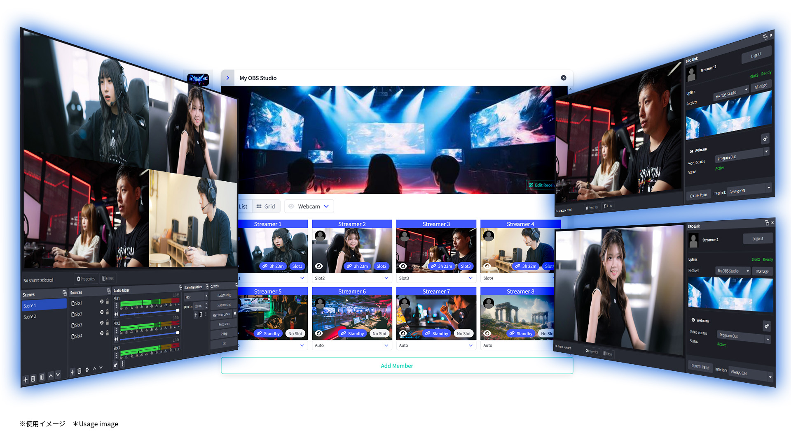

# SRC-Link (The OBS Studio Plugin)

## Concept

[OBS Studio](https://obsproject.com/) プラグイン SRT-Link (Secure Reliable Controllable Link) の基本的なコンセプトは、
OBS を強力な映像トランスミッター及びレシーバーに変えることです。

OBS Studio には、多種多様なインプットがあります。秀逸なゲームキャプチャ―機能（残念ながら OBS 31 で少し互換性問題がありますが、いずれ修正されると思います）があります。
エフェクトもオーバーレイもコンポジット機能もあります。プラグインでそれらを強化することもできます。更にオープンソースなので OBS 自体を改良することもできます。

ただ、そこに無いのは、複数のストリームを安定して送出する機能と接続を管理する機能です。SRC-Link がそれらを提供します。

SRC-Link はウェブサービスの [SRC-Link Control Panel](https://src-link.live/introduction) とともに使用します。

**キーフィーチャー**

- 映像トランスミッター・レシーバー (SRTプロトコルを基盤とする)
- コネクション管理
- WebSocket ポータル for OBS (obs-websocket 互換サーバー)
- 運営チーム (SRC-Link のリソースをチームで共有)

**主な機能**

- ホストは、ゲストから複数のクリーンフィード（映像音声）をパラで受信することができます。受信対象はメンバーの中から選択することができます。
- ゲストは、レシーバーに接続してスタンバイ状態になることができます。
  スタンバイ状態は送信開始がいつでも可能な状態で、ホストのコマンドによって映像音声の送信を開始します。
- ゲストに接続情報（アドレス、ストリームID、パスワード等）を送付する必要はありません。
  ゲストはそれらを OBS Studio に設定する必要がありません。
- ホストは、ゲストのスタンバイ状態と映像スクリーンショット（5～30秒間隔で更新）を SRC-Link Control Panel 上で確認できます。
- スタンバイ状態のゲストは、文字通り映像音声を送信せずに待機しているだけなので、理論上、ホストが受信可能なストリーム数よりはるかに多い数（10 でも 100 でも 1,000 でも）存在できます。
  ※ただし、SRC-Link Control Panel のプランで上限があります。
- 映像音声の伝送プロトコルは SRT を使用しています。ストリームIDやパスフレーズは SRC-Link Control Panel により制御されます。
- **(0.5.5 より)** 運営チームを使用すると、組織のスタッフ間でレシーバーを共有し、ライブ配信を共同で運営できます。
- **(0.6.0 より)** ストリーム録画機能は、ゲストのローカルディスクにクリーンフィードを録画します。
- **(0.6.0 より)** 外部コネクションは、vMix や SRT MiniServer、Nimble Streamer 等の外部 SRT サーバーと SRC-Link を接続できます。
- **(0.7.0 より)** WebSocket ポータル for OBS は obs-websocket 互換のサーバーを提供し、obs-websocket クライアントを使った、
  インターネット越しに OBS Studio のリモートコントロールを可能にします。ポートの開放やトンネリング、VPN は不要です。
- **(0.7.2 より)** RTMP外部コネクションで、ソース毎に外部の RTMP サーバーへ配信できます。

**用語集**

- **ホスト**: 映像音声を受信する OBS インスタンス（及び SRC-Link ユーザー）
- **ゲスト**: 映像音声を送信する OBS インスタンス（及び SRC-Link ユーザー）
- **レシーバー**: ホストが扱うインプットのグループを表します。 通常は単一の OBS インスタンスが想定されますが、複数で受信することも可能です。 レシーバーには複数のスロット、複数のメンバーが含まれます。
- **スロット**: 1 つのスロットは、ゲスト 1 人分のインプットのセットを表します。つまり、スロット 1 つにつき複数のソース (Web カメラ、ゲームキャプチャなど) を設定できます。ゲストはすべてのソースをパラで送信しますから、ホスト側でスイッチングや合成が可能です。
- **ソース**: ゲストは複数のソースをパラで送信できます。ソースの数はホストによって指定され、ゲストは自身の OBS ソースから自由にビデオとオーディオを選択できます。
- **メンバー**: レシーバーに接続して待機可能な、登録済みのゲストです。
- **招待コード**: レシーバーにゲストを招待するには、ホストが招待コードを生成してゲストへ送付します。ゲストはコードを引き換える事でメンバーになります。
- **ゲストコード**: ゲストからホストに参加を申し込むには、自身のゲストコードをホストに送付します。ホストはゲストコードを使用してメンバー登録します。
- **ダウンリンク**: ホスト側の入力接続
- **アップリンク**: ゲスト側の出力接続

## Requirements

[OBS Studio](https://obsproject.com/) >= 30.1.0 (Qt6, x64/ARM64/AppleSilicon)

(*) MacOS, Linux Up to 30.2.3

(*) Linux required install `qt6-websockets` separately.

また、[SRC-Link Control Panel](https://src-link.live) へのサインアップが必要です。
別途、[有償サブスクリプションプラン](https://src-link.live/subscriptions/plans)があります。

# Installation

次のページよりインストラーパッケージをダウンロードしてください: [Release](https://github.com/OPENSPHERE-Inc/src-link/releases)

> 注意: Windows インストーラーは必要なライブラリとして `Qt6WebSockets.dll` と Qt6 の `tls` プラグインフォルダを `obs-studio/bin/64bit` 配下にコピーします。

# User manual

[より詳細な手引きをブログに掲載しています](https://blog.opensphere.co.jp/posts/tags/src-link)

## ホスト向け

1. ウェブブラウザで[SRC-Link Control Panel](https://src-link.live) にサインアップ／ログインし、レシーバーをセットアップします。
   通常は、サインアップ直後にサンプルが作成されているので、これを編集します。
   
   まず必要な数（ストリームに同時出演するゲスト数）だけスロットを追加／削除します。

   次にゲスト1人から受信したいインプット数分だけソースを追加／削除します（例: ウェブカメラとゲーム画面なら 2 個）

2. **基本的に、ホストはレシーバーにメンバー登録する必要はありません。**

   テストの目的で自分自身を登録したい場合は、そのようにできます。
   自分で送信して自分で受信することもできますが映像がループする場合があります。
   映像の送信方法は [ゲストの手順](#ゲスト向け) を参照してください。

3. OBS Studio に SRC-Link プラグインをインストールします [ダウンロードはこちら](https://github.com/OPENSPHERE-Inc/src-link/releases)

4. OBS Studio を立ち上げ、「ツール」メニューから「SRC-Link 設定」、あるいは「SRC-Link」ドックの「ログイン」ボタンをクリックします。

5. ウェブブラウザが開いて承認画面が表示されます。「承認」ボタンをクリックします。

   こちらで OBS Studio と SRC-Link Control Panel が接続され、使用可能になりました。

6. OBS Studio の「ツール」メニューから「SRC-Link 設定」を開いてください。
   「待ち受けUDPポート範囲」で、使用する UDP ポートの範囲を設定してください。これらのポートは外部からアクセス可能でなければなりません。
   NATルーターや FW 環境の方はポートの開放を行ってください。

   必要となるポートの数はソースの総数と同じです。

   ポート開放が難しい環境では、[リレーサーバーの導入](https://src-link.live/docs/relay-server) を検討してください。

7. OBS Studio でソースに「SRC-Link ダウンリンク」を追加してください。
   ソースプロパティで、このインプットが受信するレシーバー、スロット、ソースを選択します。
   これらは同じ組み合わせの物が他のソースに存在してはいけません（エラーは出ませんが競合して片方しか受信しません）

   ソースプロパティでは解像度とビットレート範囲も設定でき、これらの設定はゲスト側設定のレギュレーターとして機能します。

   「リレーサーバー」は使用したい場合にチェックを入れてください。プランで有効でない場合、またはセットアップされていない場合はチェックできません。

8. OK を押してソースプロパティを閉じるとソースが受信スタンバイ状態となります（正しく設定されていれば、赤い警告表示が消えます）

9. 再び SRC-Link Control Panel の [ホスト](https://src-link.live/receivers) メニューを開いて、レシーバーに出演予定者分だけメンバー追加します。
   ゲストに招待コードを送るやり方と、ゲストからゲストコードを受け取って入力する方法の二通りあります。
   招待コード・ゲストコード共には `abcd-efgh-1234-5678` の形式です。

   招待コードを送った場合は、ゲストによって承認されるのを待ちます。

   本番前のよきタイミングで、ゲストにスタンバイ状態になるように伝えてください。

   スタンバイ状態のメンバーはリンクアイコンがアクティブになり、スクリーンショットが表示されます。
   スクリーンショットは 5 秒から 30 秒程度で随時更新されます。

10. SRC-Link Control Panel の [ホスト](https://src-link.live/receivers) メニューで、メンバーの中から出演者をスロットに割り当てます。
    スロットに割り当てられたメンバーからのみ、ストリームを受信できます。

11. メンバーがスタンバイ状態なら、スロットに割り当てた段階で映像が OBS Studio の SRC-Link ダウンリンクに表示されます。

12. スロットを切り替えると OBS Studio 側の映像も自動的に切り替わります。

## ゲスト向け

1. ウェブブラウザで[SRC-Link Control Panel](https://src-link.live) にサインアップ／ログインしてください。

2. OBS Studio に SRC-Link プラグインをインストールします [ダウンロードはこちら](https://github.com/OPENSPHERE-Inc/src-link/releases)

3. OBS Studio を立ち上げ、「ツール」メニューから「SRC-Link 設定」、あるいは「SRC-Link」ドックの「ログイン」ボタンをクリックします。

4. ウェブブラウザが開いて承認画面が表示されます。「承認」ボタンをクリックします。

   こちらで OBS Studio と SRC-Link Control Panel が接続され、使用可能になりました。

5. ホストのレシーバーに参加します。参加する方法は、ホストへゲストコードを送付して追加してもらうやり方と、ホストに招待コードを生成してもらって自分で入力するやり方の二通りあります。
   - ゲストコードの場合

     SRC-Link Control Panel で [ゲストコード](https://src-link.live/accounts/access-codes) メニューを開き、デフォルトでサンプル生成済みのゲストコードをコピーするか、
     新たに「作成」をクリックして新しい物を作ってください。

   - 招待コードの場合

     ホストが自分のメールアドレスを知っていて、SRC-Link Control Panel (noreply@src-link.live) からメールが送られてきた場合は、
     記載されているアクティベーション URL をクリックして承認してください。

     ホストから招待コードのみが送られてきた場合は SRC-Link Control Panel の [ゲスト](https://src-link.live/memberships) メニューで「招待コードを引き換える」ボタンをクリックし、
     招待コードを入力してください。

6. レシーバーのメンバーになると、OBS Studio の「SRC-Link」ドックにレシーバーが表示されます（複数参加している場合はプルダウンで選択してください）
   
   レシーバーを選択すると「アップリンク」がアクティブになり、ソースが選択可能になります。
   それぞれのソースに送信したいインプットを割り当ててください。
   ソースの数と内容はホストが指定しています。

   指定はあってもゲスト側で「なし」に設定することもできますが、ソースの使い方はホストと相談してください。

   ソースそれぞれ「ギア」アイコンをクリックすると、ビットレートや映像・音声エンコーダー、音声ソースを設定できます。

7. デフォルトでは SRC-Link のアップリンクは「仮想カメラ」と連動する設定になっています。OBS Studio の「仮想カメラ」を開始すると SRC-Link のアップリンクもスタンバイ状態になります。
   
   連動は他に「録画」「配信または録画」や「仮想カメラ」、あるいは「常にON」から選択可能です。

   スタンバイ状態はいつホストから映像音声が視聴されても問題ない状態としてください。
   問題がある場合はスタンバイ状態を解除するかアップリンクの「眼」アイコンをクリックしてソースをミュートします。

8. 出演が終わってレシーバーから退出したい場合は、SRC-Link Control Panel [ゲスト](https://src-link.live/memberships) メニューで、レシーバーの「退出」ボタンをクリックしてください。

# Development

This plugin is developed under [obs-plugintemplate](https://github.com/obsproject/obs-plugintemplate)

## Using Open Source Libraries

- [Qt6 + Qt WebSockets](https://www.qt.io/)
- [o2](https://github.com/pipacs/o2) (Qt based OAuth2 client)
- [json](https://github.com/nlohmann/json) (JSON for Modern C++)
- [Font Awesome](https://fontawesome.com) Free 6.7.0 by @fontawesome - https://fontawesome.com License - https://fontawesome.com/license/free Copyright 2024 Fonticons, Inc.
- [OBS Studio](https://obsproject.com/)
